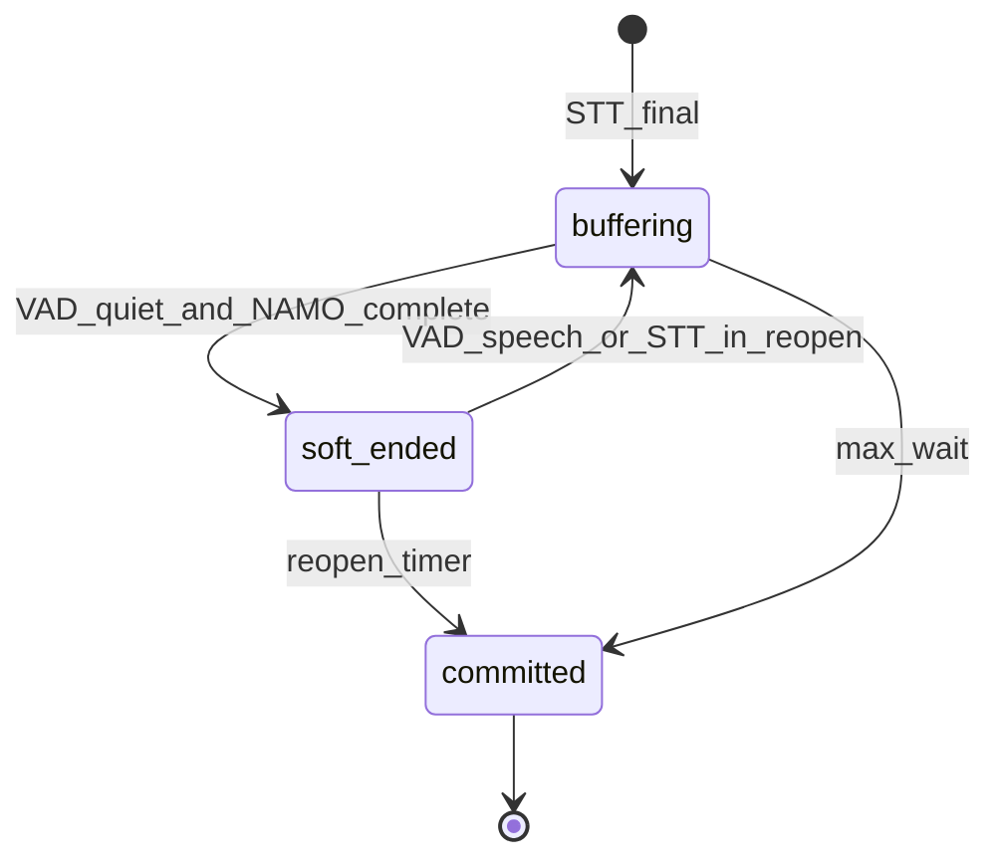

# VoIP turn detection (Namo + TEN VAD)

## `VOIP_STT_MESSAGE_HANDLING`

| Value | STT finals | Turn commit |
|-------|------------|-------------|
| **NAMO** (recommended) | Buffered in `botMsgs` | Namo gate + TEN VAD only (`commitNamoFlush`); no VoIP worker `setSttSilenceDuration` |
| **PSST** / **JOIN** / **CONCAT** | Buffered | With `VOIP_STT_TURN_HANDLER=NAMO`, legacy **PSST+NAMO** is normalized to **NAMO** on connector validate |
| **ORIGINAL** | Immediate emit | Namo gate not used |
| **SPLIT** | Immediate per sentence | Namo gate not used |

Objective tests with `VOIP_OTS_LATENCY_PROFILE` default handling to **NAMO** when unset (`applyOtsLatencyProfile`).

- **buffering** — append STT finals; never `queueBotSays`.
- **soft_ended** — ready to emit; reopenable (`VOIP_NAMO_REOPEN_MS`).
- **committed** — only path that flushes to the coach (`namo_flush`, `namoGate.committed`).

VAD **speech start** (or another STT final) during `soft_ended` reopens the turn (card readback join). VAD **speech end** does not commit alone; `max_wait` is the hard fallback.

## Gates

- **Cohesion** — Namo on joined vs last segment.
- **Emit stability** — `VOIP_NAMO_EMIT_STABLE_MS` before soft-end.
- **Short-segment merge** — `VOIP_NAMO_VAD_SHORT_SEGMENT_MERGE_MS`.
- **DTMF echo** — digit-only STT after agent DTMF suppressed.

## PSST fallback

If Namo model init or inference fails, the connector disables Namo and uses the legacy PSST silence timer (`VOIP_NAMO_FALLBACK_HANDLING`).

## Manual verification (OTS logs)

1. Set handling **NAMO** (or rely on OTS defaults / legacy PSST+NAMO shim).
2. Expect per bot turn: `stt_final` → `namo_candidate_received` / `namo_decision` → `namo_flush`.
3. No VoIP worker `setSttSilenceDuration` while handling is NAMO; `voip.psstTimerArmed` from the gate should include `strategy: NAMO`.
4. **ORIGINAL** chatbots should still emit on each final without `namo_decision`.
5. Force Namo failure (invalid model path): `namo_model_error` then PSST fallback timers / flush.
